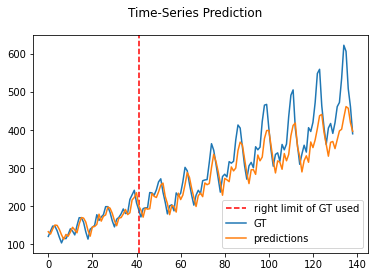

# flight-passengers-prediction-LSTM

The idea of this project was to use an LSTM in Pytorch in order to predict the total number of passengers (in 1000s) from a subset of the US airline passengers dataset which is built-in in R. The results training the network on 30% of the data can be seen below.

